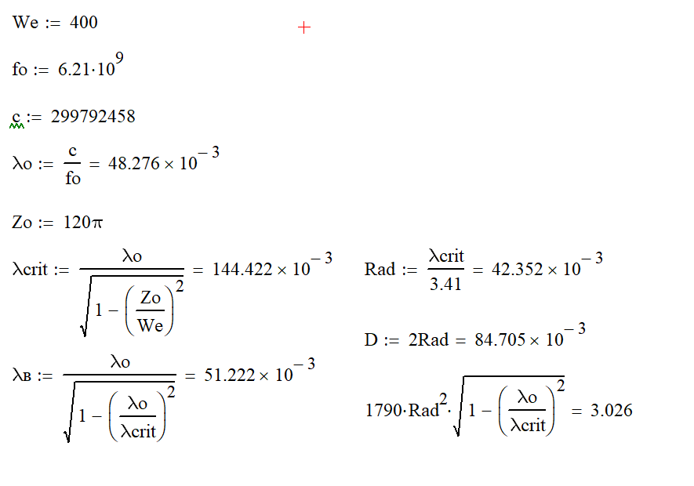
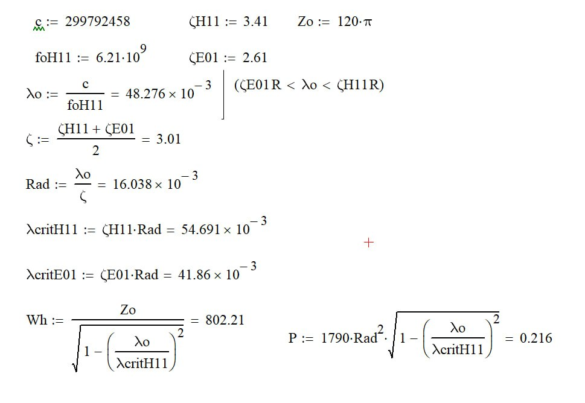
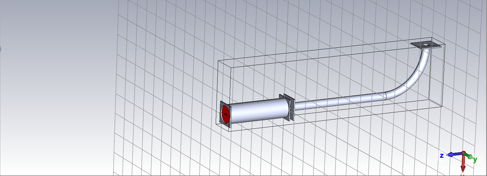

# Проектирование круглого волновода (6.21 ГГц)

Этот репозиторий содержит расчеты и результаты 3D-моделирования круглого волновода, рассчитанного на рабочую частоту **6.21 ГГц**. 

Расчет геометрических и электродинамических параметров волновода (радиус, критические длины волн для моды H11, волновое сопротивление) проводился в математическом пакете. Базовый радиус волновода был рассчитан исходя из заданных частотных ограничений.

На основе полученных математических данных была построена 3D-модель волновода с изгибом в среде электромагнитного моделирования. 

График Z-параметров (модуль сопротивления) показывает отличный результат на расчетной частоте:
* **Частота:** 6.2106 ГГц
* **Сопротивление (Z1,1):** ~485 Ом
* **КСВ:** ~1.2

