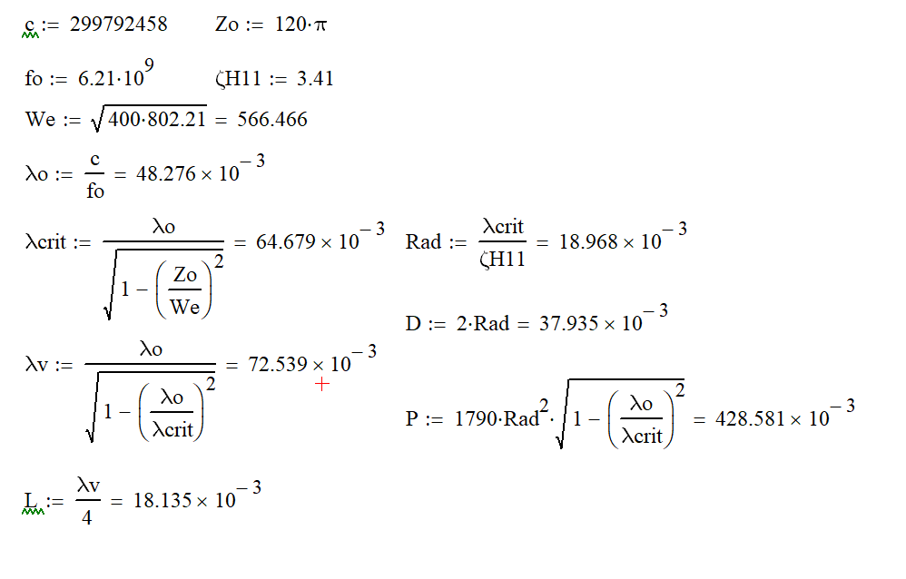
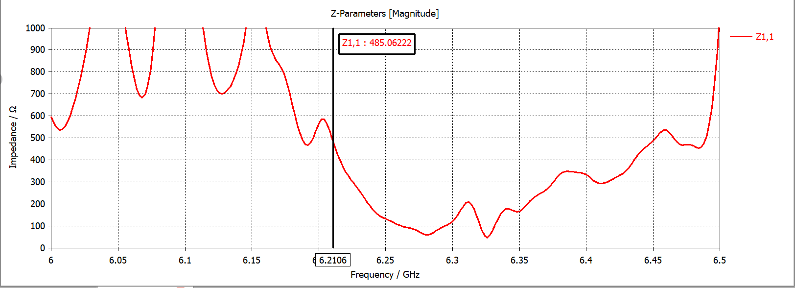

  <b>Русский</b> | <a href="README.en.md">English</a> | <a href="README.de.md">Deutsch</a>

# Проектирование круглого волновода (6.21 ГГц)

Репозиторий содержит аналитические расчеты и результаты трехмерного электромагнитного моделирования круглого волновода с согласующим переходом, спроектированного для работы на частоте **6.21 ГГц**.

Проект включает в себя расчет геометрических параметров волноводного тракта, подбор размеров согласующего звена и верификацию характеристик структуры в среде конечно-разностного временного анализа (FDTD).

---

## Структура проекта

* `/calculations` — математические расчеты параметров волноводов и согласующего трансформатора в формате Mathcad (`.xmcd`).
* `/simulation` — проект трехмерного электромагнитного моделирования в CST Studio Suite (`.cst`).
* `/docs/images` — графические материалы и скриншоты результатов.

---

## Аналитический расчет

Расчет геометрических и электродинамических параметров (радиус волновода, критическая длина волны для основной моды $H_{11}$, волновое сопротивление) выполнен в среде Mathcad. Базовые размеры определены с учетом частотных ограничений для обеспечения одномодового режима работы.

### 1. Расчет входного волновода (400 Ом)
Определение базовых геометрических размеров для обеспечения требуемого волнового сопротивления на рабочей частоте.

### 2. Расчет согласующей секции
Расчет параметров четвертьволнового трансформатора для минимизации отражений на стыке двух секций.

### 3. Расчет выходного волновода (800 Ом)
Расчет геометрии волновода с повышенным волновым сопротивлением.

---

## Численное моделирование (3D)

На основе аналитических расчетов в CST Studio Suite построена трехмерная модель круглого волновода с изгибом и согласующим переходом.

### Результаты анализа Z-параметров

График модуля входного сопротивления ($Z_{1,1}$) подтверждает расчетные параметры на рабочей частоте:
* **Рабочая частота:** 6.2106 ГГц
* **Входное сопротивление ($Z_{1,1}$):** ~485 Ом
* **КСВ (VSWR):** ~1.2

## Лицензия

Copyright (c) 2026 Илья Корнилов

Этот исходный документ описывает открытое аппаратное обеспечение (Open Hardware) и распространяется под лицензией CERN-OHL-P v2. 
Вы можете распространять и изменять этот исходный документ, а также производить на его основе продукты в соответствии с 
условиями лицензии CERN-OHL-P v2 (https://cern.ch/cern-ohl).

Этот исходный документ распространяется БЕЗ КАКИХ-ЛИБО ЯВНЫХ ИЛИ ПОДРАЗУМЕВАЕМЫХ ГАРАНТИЙ, 
ВКЛЮЧАЯ ГАРАНТИИ ТОВАРНОЙ ПРИГОДНОСТИ, УДОВЛЕТВОРИТЕЛЬНОГО КАЧЕСТВА ИЛИ СООТВЕТСТВИЯ 
КОНКРЕТНЫМ ЦЕЛЯМ. Пожалуйста, ознакомьтесь с условиями CERN-OHL-P v2 для получения подробной информации.